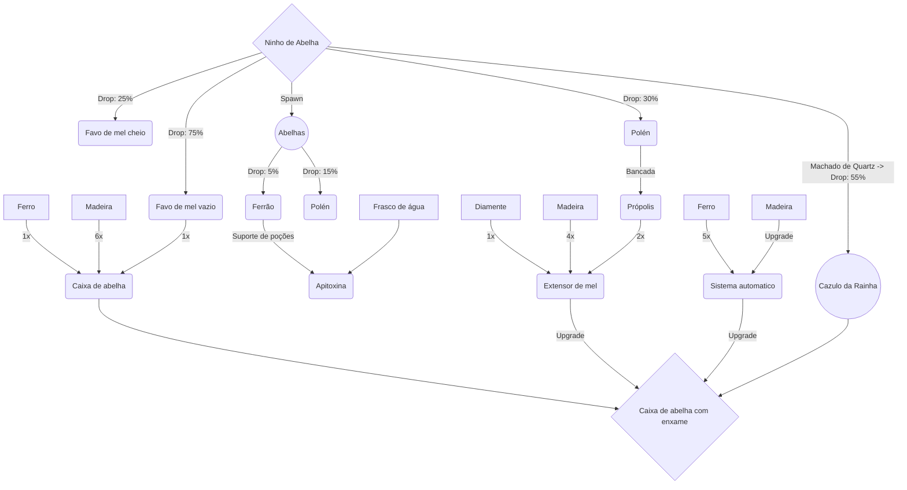

# FARMINE MOD

O mod é voltado nas referencias a fazendas, sendo assim ira adicionar novos animais (Animações, IA e atributos), alem de minérios, produtos e outros detalhes.

➼ _Todas as modificações **não alteram** nenhum comportamento dos animais vanila do minecraft._

 

## Patch update: **BEES v0.1**

    Primeira atualização do mod, voltado as abelhas com inumeras variedades de 
    especies e seus derivados (mel, polen, ferrao, etc).

### Funcionalidades:
  Agoras as novas abelhas adicionadas estão mais realistas, animações de voo, ferroada entre outros.
    Todas as especies são spawnadas proximo dos seus [ninhos de abelhas](https://github.com/Secoide/Farmine_Forge_1.19.4/edit/master/README.md#adicionado) refente o seu tipo (ferrão ou sem ferrão).
As abelhas e ninhos irão dropar itens de suas propriedades quando mortas e quebradas, respectivamente.

### Desenvolvimento:
- :white_check_mark: Criar modelo e animação da abelha europeia.
- :white_check_mark: Criar modelo e animação do ninho de abelha de ferrão.
- :white_check_mark: Adicionar itens e blocos, derivados das abelhas europeias.
- :construction: Adicionar abelha europeia.
- :timer_clock: Spawnar ninhos de abelha em copas de arvores (Selva e Savana). (Raridade: médeia).
- :white_check_mark: Produtos criados a partir dos itens das abelhas;
- :timer_clock: Ninhos de abelha com niveis de mel e força do enxame de abelha.
- :snowflake: Criar 3 tipos de modelo de caixa de abelha europeia (base do enxame, extensão produção do mel, caixa automatica);

>**Legenda:** 
>:timer_clock: = Em seguida |
>:construction: = Em construção |
>:white_check_mark: = Realizado |
>:snowflake:	= Parado/Sem previsão |
>:stop_sign: = Cancelado |

 

#### Mobs/Blocks

| Versão | Descrição | Status |
| :---: | --- | :---: | 
| 0.1 | Abelha europeia | 60% |
| 0.1 | Ninho de Abelha com ferrão | 40% |
| 0.1 | Drops e podutos | 90% |
| 0.1 | Abelha africana | 30% |
| 0.1 | Abelha jataí | 0% |
| 0.2 | Vespa asiática | 0% |
| 0.2 | Abelha Verde (RARA) | 0% |

  

<!-- Oculto-->

 (SPOILER) Adicões

  
### Drops
  
  
  
  
### Produtos
  
  
  
  
  
  
### Abelhas
> Abelha Europeia/Africana

<figure >
   
   
  </figure>

>Ninho de abelha

  

  

 

### Fluxograma do Mod

  

